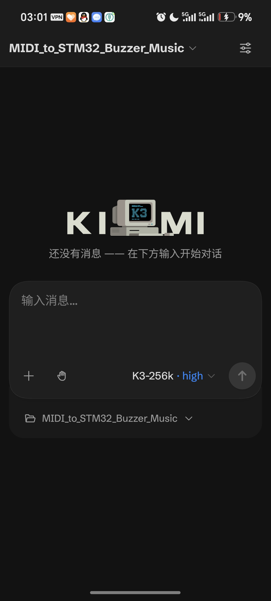
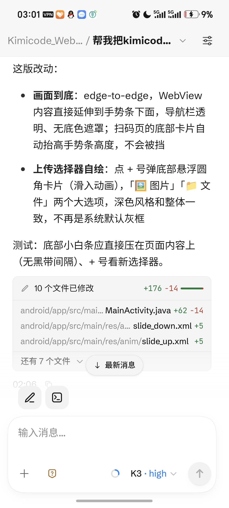

# Kimi Code WebUI Desktop

[中文](README.md)

Unofficial desktop client for [Kimi Code](https://www.kimi.com/code) — wraps the Kimi Code WebUI into a native app with Tauri 2.

**[⬇️ Download the latest release](https://github.com/hommy36/kimicode-webui-desktop/releases)**


## Features

- Embeds the Kimi Code WebUI: automatically starts the local `kimi web` service on launch and navigates to it with the auth token
- Custom frameless top bar: window dragging, minimize / maximize / close buttons
- Shows the installed and latest CLI versions in the top bar, with one-click update
- Guides you through installing the Kimi Code CLI via the official script when it's not detected
- Remote control: one toggle + a channel dropdown on the "Remote" page. The two channels are mutually exclusive (kimi requires `--remote-control` to bind loopback, which conflicts with the direct channel's `--host 0.0.0.0`, so only one can be on at a time):
  - **Direct (LAN / Tailscale)**: enable it from the "Remote" page in the top bar, then scan the QR code to open the WebUI from your phone on the same WiFi (built on `kimi web`'s `--host 0.0.0.0` and bearer-token auth; the setting persists; a one-click button adds the firewall rule if the phone can't connect). Free, no account needed — works with any model provider
  - **Official Remote Control** (experimental, requires kimi ≥ v0.39.0): cloud relay via code-rc.kimi.com with a dedicated mobile UI, works across networks; requires Kimi account sign-in. When enabled, the service starts as `kimi web --remote-control`; scan the QR code or open the link to use it
- App UI (top bar / placeholder / remote page) automatically follows the WebUI's light / dark theme
- UI language follows the system language (Chinese / English; the WebUI itself is controlled by Kimi Code)

## Android client: KimiCode Remote

The `android/` directory contains a companion native Android client (Java + WebView, no third-party frameworks) for using the same WebUI on your phone:

| Dark | Light |
| --- | --- |
|  |  |

- Two connection modes: scan/enter a **direct address** (the `http://IP:port` link from the desktop app's Remote page), or an **official RC link** (`code-rc.kimi.com`, with in-app account sign-in)
- Remembers the last connection and loads it on launch; falls back to the scanner on failure, double-press back to leave a session
- Fully immersive: status/navigation bar colors and icons follow the page brightness; the WebUI theme follows the system
- Custom-drawn scanner (rounded frame), bottom input card, and upload picker (image / file), all in light & dark themes

See `android/README.md` for APK build instructions.

## JetBrains plugin

The `jetbrains/` directory contains a plugin for JetBrains IDEs (CLion / PyCharm / IDEA 2025.2+) that embeds the WebUI in a tool window via JCEF: it attaches to a running `kimi web` service or spawns one rooted at the current project, and the theme follows the IDE. Build and install instructions: `jetbrains/README.md`.

## Remote access beyond LAN (Tailscale)

Campus and enterprise networks usually isolate clients from each other, so even devices on the same network can't connect. For true remote control over any network (4G, away from home):

1. Install [Tailscale](https://tailscale.com) on both the computer and your phone (free)
2. Sign in with the same account on both
3. Enable remote access in the app, pick the `100.x` address in the IP dropdown, and scan the QR code — it works over any network

Security model: WireGuard end-to-end encryption + Tailscale account admission + the token in the link.

If you don't want to install anything, `cloudflared tunnel --url http://localhost:58627` gives you a temporary public URL instead (at your own risk of public exposure).

## Requirements

- Windows
- [Kimi Code CLI](https://www.kimi.com/code) (can be installed from within the app)

## Development

```bash
pnpm install
pnpm dev
```

## Build

```bash
pnpm build
```

Installers are generated under `src-tauri/target/release/bundle/`.

## How it works

- Two webviews in one window: the window's own webview renders the top bar (`src/index.html`); a child webview renders the content area (`src/main.html` placeholder → navigated to the WebUI once ready)
- `kimi web` prefers the fixed port 58627: the WebUI keeps onboarding state in localStorage, which is scoped by origin (including port), so a stable port preserves it across launches
- UI strings switch between Chinese and English via `navigator.language`; the Rust side only sends i18n keys (errors as `key|detail`) and the frontend translates them
- Set `KIMI_DESKTOP_SIMULATE_MISSING=1` to simulate a missing CLI and test the install guide screen

## License

MIT
