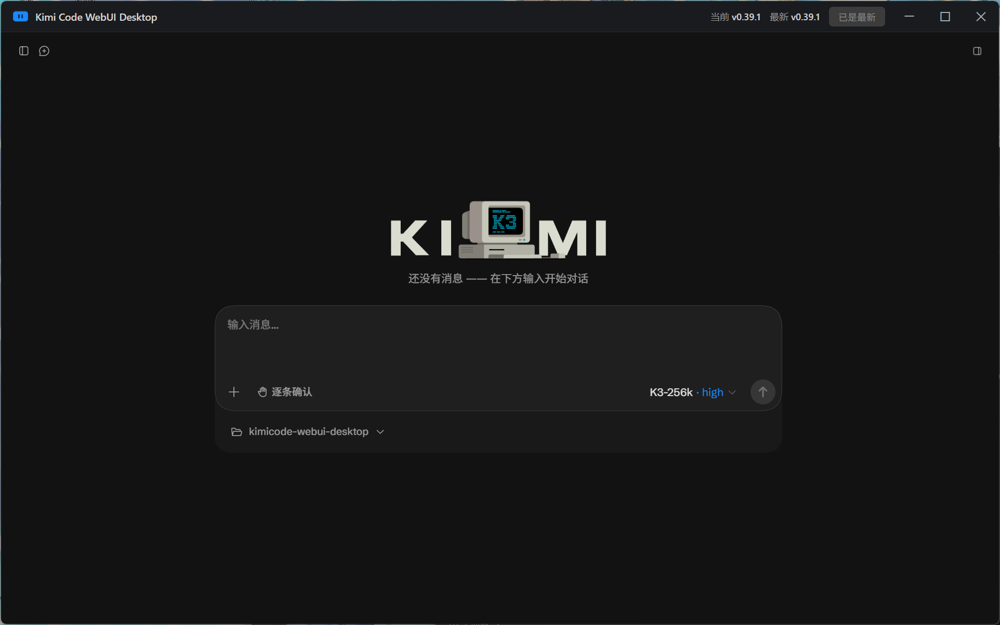
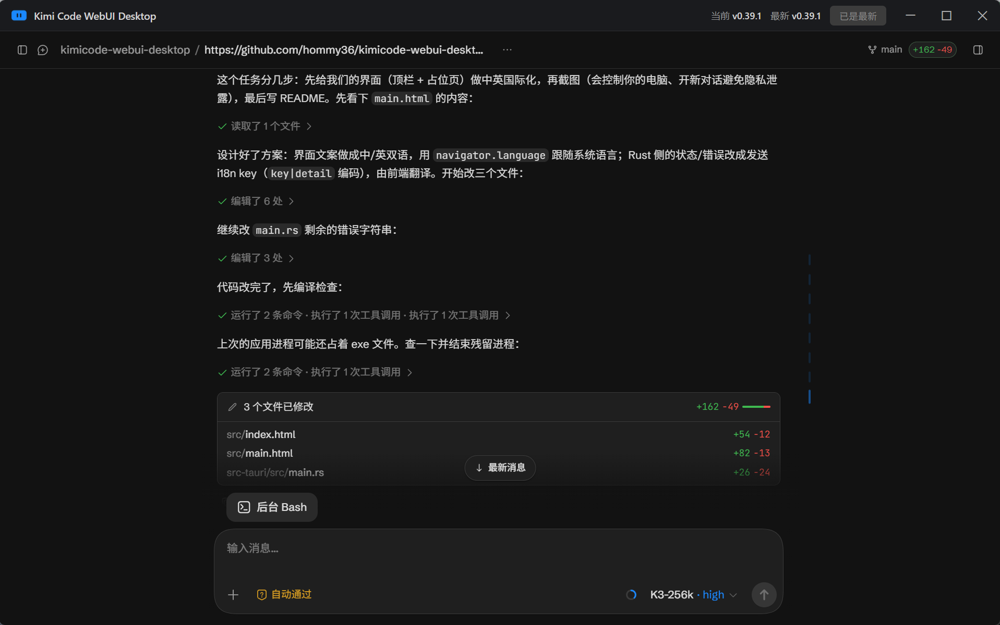

# Kimi Code WebUI Desktop

[中文](README.md)

Unofficial desktop client for [Kimi Code](https://www.kimi.com/code) — wraps the Kimi Code WebUI into a native app with Tauri 2.

**[⬇️ Download the latest release](https://github.com/hommy36/kimicode-webui-desktop/releases)**





## Features

- Embeds the Kimi Code WebUI: automatically starts the local `kimi web` service on launch and navigates to it with the auth token
- Custom frameless top bar: window dragging, minimize / maximize / close buttons
- Shows the installed and latest CLI versions in the top bar, with one-click update
- Guides you through installing the Kimi Code CLI via the official script when it's not detected
- UI language follows the system language (Chinese / English; the WebUI itself is controlled by Kimi Code)

## Requirements

- Windows
- [Kimi Code CLI](https://www.kimi.com/code) (can be installed from within the app)

## Development

```bash
pnpm install
pnpm dev
```

## Build

```bash
pnpm build
```

Installers are generated under `src-tauri/target/release/bundle/`.

## How it works

- Two webviews in one window: the window's own webview renders the top bar (`src/index.html`); a child webview renders the content area (`src/main.html` placeholder → navigated to the WebUI once ready)
- `kimi web` prefers the fixed port 58627: the WebUI keeps onboarding state in localStorage, which is scoped by origin (including port), so a stable port preserves it across launches
- UI strings switch between Chinese and English via `navigator.language`; the Rust side only sends i18n keys (errors as `key|detail`) and the frontend translates them
- Set `KIMI_DESKTOP_SIMULATE_MISSING=1` to simulate a missing CLI and test the install guide screen

## License

MIT
